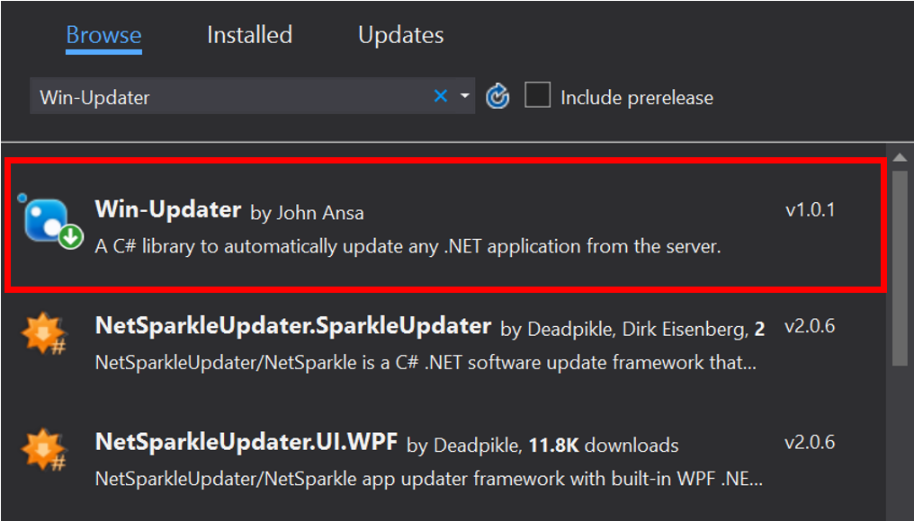
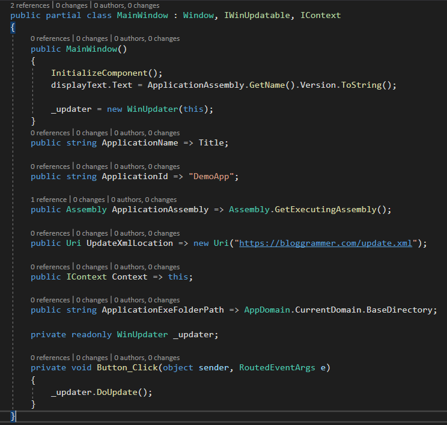
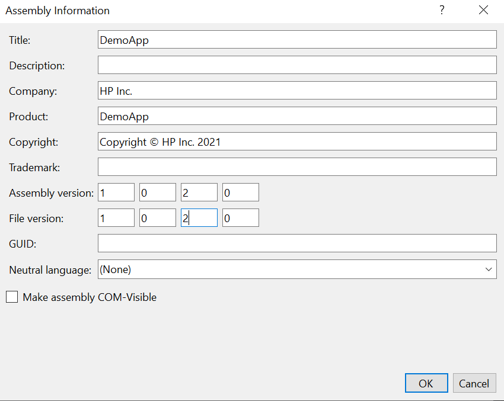

 [](https://www.nuget.org/packages/Win-Updater/)

# Windows Auto Updater

A C# library that will allow you to automatically update any .NET application from the server.  

`WinUpdate` is a multi-threaded .NET application updater that won't freeze any Windows applications while checking for updates or downloading them.  

This awesome updater supports: 

- WPF application
- Windows Forms application
- Console application

## Sample Usage

1. Download the library from nugdet package via Visual Studio or CLI


2. Implement the `IWinUpdatable` and `IContext`
 
 ```c#
        public interface IWinUpdatable
        {
            /// <summary>
            /// The name of your application as you want it displayed on the update window.
            /// </summary>
            string ApplicationName { get; }
            /// <summary>
            /// An identifier string to use to identify your application in the update.xml
            /// Should be the same as your appId in the update.xml
            /// </summary>
            string ApplicationId { get; }
            /// <summary>
            /// The application executable folder path (the folder path where the exe file is placed)
            /// </summary>
            string ApplicationExeFolderPath { get; }   
            /// <summary>
            /// The current assembly
            /// </summary>
            Assembly ApplicationAssembly { get; }
            /// <summary>
            /// The location of the update.xml on the server
            /// </summary>
            Uri UpdateXmlLocation { get; }
            /// <summary>
            /// The program main window.
            /// </summary>
            IContext Context { get; }
        }
   ``` 
   


    
3. Create a the application meta data in xml  named "update.xml" 
	```xml
		<?xml version="1.0"?>
        <winUpdate>
           <update appId="DemoApp">
             <version>1.0.2.</version>         
             <url>https://bloggrammer.com/DemoApp.exe</url>
             <fileName>DemoApp.exe</fileName>
             <md5>b82bbef98e7bb6a9f98b9a7d3724b64b</md5>
             <description>Testing updater</description> 
             <launchArgs></launchArgs>
           </update>
        </winUpdate>

> NB: The MD5 hash is used to ensure the integrity of the exe file that
> is uploaded to the server. The updater watches out for changes in
> version number. If the server exe file version number is higher than
> that of the client, the update from the server is downloaded to the
> client and the older exe file replaced.

4. Update the app version number and in Visual Studio and rebuild the project
 
 5. Upload the updated exe file and the update.xml file to the server. https://bloggrammer.com/update.xml
 6. Run the demo application and click "Check for updates"
